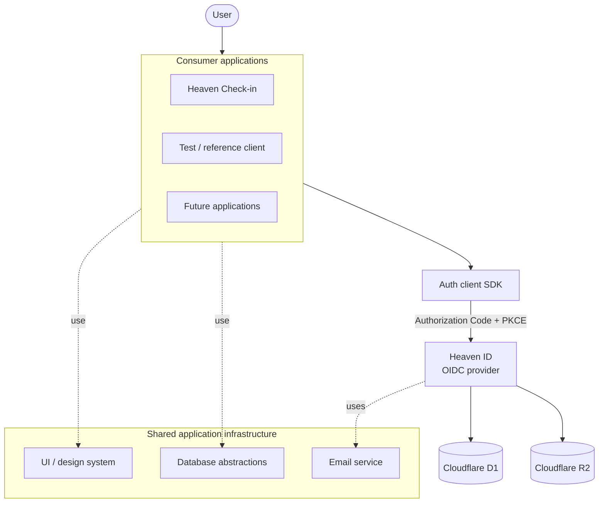

# Heaven Platform: Identity as Shared Application Infrastructure

Heaven Platform is a privately implemented, publicly operated application platform built around a shared identity boundary. The source repository remains private by design; this case study documents the architecture, engineering boundaries, and verification strategy without exposing secrets or privileged implementation details.

## Problem

As more applications began sharing authentication, duplicating login, session, social-provider, and token-handling logic in every application would have created inconsistent security behavior and tighter coupling.

The platform therefore treats identity as shared infrastructure rather than application-specific UI.

## Architecture



The main boundary is deliberate:

- **Heaven ID** owns authentication, sessions, OIDC behavior, service-provider registration, social identity integration, and audit-oriented identity operations.
- **Auth client SDK** gives consuming applications one integration surface for OIDC flows instead of duplicating protocol handling.
- **Consumer applications** own their product behavior and depend on identity through the protocol / SDK boundary.
- **Shared infrastructure packages** contain reusable application capabilities without turning the monorepo into a catch-all repository.

## Why OIDC + PKCE

A shared identity service only helps if applications can integrate through a stable contract. The platform uses OpenID Connect and Authorization Code Flow with PKCE so consumers depend on a protocol boundary rather than internal database or implementation details.

This makes a future application closer to:

```text
application
    ↓
auth client
    ↓
OIDC contract
    ↓
Heaven ID
```

instead of embedding identity-specific logic throughout each codebase.

## Verification strategy

Authentication code is a poor place to rely on "the page loaded" as the success criterion. The monorepo therefore includes a centralized Playwright E2E environment spanning the identity service and real consumer applications.

The test environment coordinates:

- Heaven ID
- Heaven Check-in
- a reference OIDC client
- a mock social identity provider
- shared deterministic D1 seed data
- cross-browser Playwright execution

Time-sensitive behavior is also controlled across frontend and backend test surfaces so business rules can be verified independently of the wall clock.

The goal is to validate the system at the same boundary consumers use: application → authorization flow → identity provider → callback / session → application.

## Operational model

The platform runs primarily on Cloudflare's edge stack. It carries recurring real-world traffic; that is relevant not as a vanity metric, but because releases, regressions, and outages affect a real running service. Service continuity and public health monitoring are therefore part of the engineering responsibility.

- Cloudflare Workers for application / API execution
- D1 for application data
- R2 for object storage where appropriate
- React-based management and application interfaces
- shared CI, test, release, and deployment workflows
- public service-health visibility through the Firstsun status page

## Repository boundary

The monorepo is intentionally **not** the home for every Firstsun system.

Identity, auth clients, shared application infrastructure, and applications that evolve together belong here. Independent content contracts, public-site content, infrastructure configuration, and unrelated automation remain separate repositories.

That boundary matters more as AI-assisted development makes it cheap to add code. The architectural constraint is not how quickly another package can be generated; it is whether that package belongs inside the same lifecycle and dependency boundary.

## Engineering takeaways

1. **Identity is infrastructure, not a login page.** A protocol boundary lets multiple applications consume the same security behavior.
2. **Shared code needs a bounded context.** Reuse is useful only when it does not turn a monorepo into an organizational junk drawer.
3. **Protocol correctness requires system-level verification.** Consumer-level E2E tests cover integration behavior that unit tests cannot prove alone.
4. **Private source can still produce public engineering evidence.** Architecture, boundaries, testing strategy, and operational status can be documented without publishing credentials or implementation internals.

## Related evidence

- [Firstsun service status](https://uptime.firstsun.org/status)
- [Infrastructure overview](../infrastructure-overview.md)
- [Engineering case studies](./README.md)
