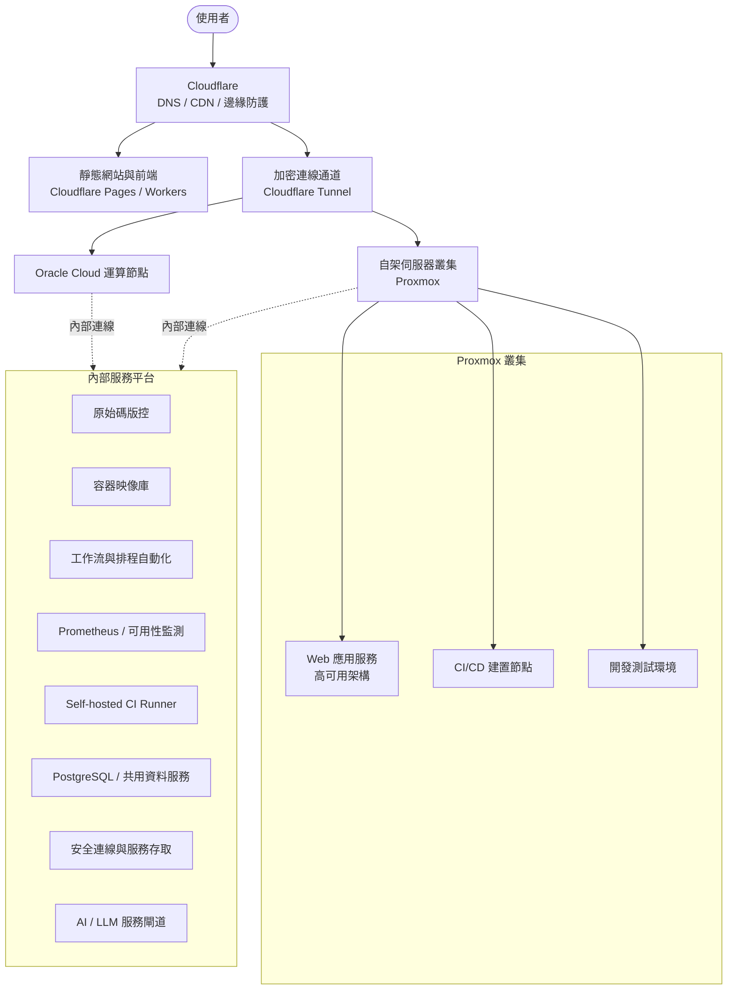

# 基礎架構總覽

本文件概述目前服務所採用的基礎架構，供對外說明整體技術輪廓使用。內容僅涵蓋高層次的架構組成，不包含內部網路位置、憑證或其他資安相關細節。

## 架構總覽圖

## 主要組成

### 1. Cloudflare（邊緣層）
所有對外流量的統一入口，負責 DNS 解析、CDN 加速與邊緣防護，並透過加密通道將流量安全地轉送至後端運算資源，避免後端主機直接暴露於公網。同時承載部分靜態網站與前端應用。

### 2. 運算與儲存資源
- **Oracle Cloud**：提供部分雲端運算節點。
- **自架伺服器叢集（Proxmox）**：以虛擬機器方式承載主要 Web 應用服務、CI/CD 建置節點與開發測試環境。
- **NAS / 備份儲存**：提供 VM、資料與服務備份所需的外部儲存空間，並與自架環境的備份流程整合。

### 3. 內部服務平台
運算資源之上運行一組共用的內部服務，支援日常開發與維運工作。除了基礎資源本身，`infra-config` 也管理多種長期運行的服務與操作流程，例如：

- **監控與可用性**：Prometheus 指標服務、服務存活與公開狀態監測。
- **CI/CD 執行環境**：self-hosted GitHub Actions runners 與相關主機組態。
- **資料服務**：PostgreSQL 等共用資料庫服務與部署設定。
- **安全連線**：Cloudflare Tunnel、內部節點連線與服務存取設定。
- **自動化平台**：排程、工作流與日常維運自動化服務。
- **容器服務管理**：Docker-based 服務的部署、更新與組態管理。
- **共用開發服務**：原始碼、映像庫、AI / LLM 服務閘道及其他內部支援服務。

### 4. 主機與服務生命週期
Proxmox 與 Oracle 節點的管理不只包含建立 VM，也涵蓋後續的主機初始化、VM template、網路與儲存設定、CI runner 部署、服務 rollout、監控與備份等操作。

這些流程以程式碼描述，使基礎設施建立、服務部署與後續維運能維持同一套可追蹤的變更流程。

## 維運方式

基礎設施與服務採 Infrastructure as Code / Configuration as Code 的方式管理：

- **Terraform** 負責 Cloudflare、Oracle Cloud、Proxmox 等雲端與虛擬化資源的宣告式佈建。
- **Ansible** 負責主機初始化、系統組態、服務部署、監控元件、CI runners、資料庫與其他共用服務。
- **公開狀態頁** 提供外部服務健康度的可觀測證據，讓服務可用性與維運責任不只停留在 repository 內部。

此作法讓環境與服務變更可追蹤、可重現，也降低人工操作造成的組態飄移風險。對 Firstsun 而言，基礎架構不是部署完成就結束，而是包含監控、備份、升級、故障偵測與持續營運在內的完整生命週期。
