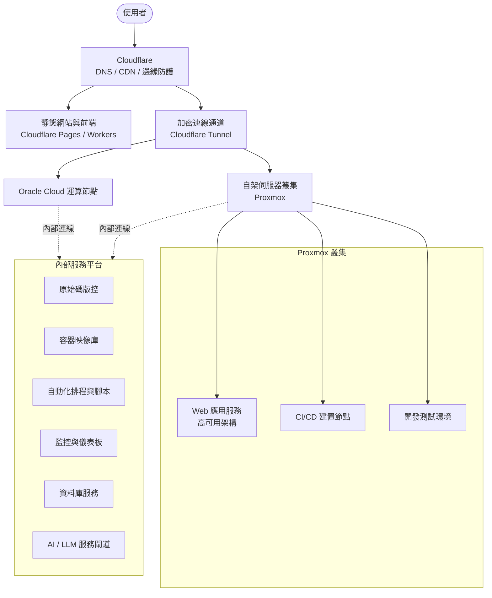

# 基礎架構總覽

本文件概述目前服務所採用的基礎架構，供對外說明整體技術輪廓使用。內容僅涵蓋高層次的架構組成，不包含內部網路位置、憑證或其他資安相關細節。

## 架構總覽圖

## 主要組成

### 1. Cloudflare（邊緣層）
所有對外流量的統一入口，負責 DNS 解析、CDN 加速與邊緣防護，並透過加密通道將流量安全地轉送至後端運算資源，避免後端主機直接暴露於公網。同時承載部分靜態網站與前端應用。

### 2. 運算資源
- **Oracle Cloud**：提供部分雲端運算節點。
- **自架伺服器叢集（Proxmox）**：以虛擬機器方式承載主要 Web 應用服務（採高可用架構設計）、CI/CD 建置節點與開發測試環境。

### 3. 內部服務平台
運算資源之上運行一組共用的內部服務，支援日常開發與維運工作，包含：
- 原始碼版控服務
- 容器映像庫
- 自動化排程與腳本執行平台
- 監控與視覺化儀表板
- 共用資料庫服務
- AI / LLM 相關服務閘道

## 維運方式

基礎設施採用 Infrastructure as Code 方式管理：
- **Terraform** 負責雲端與虛擬化資源的宣告式佈建。
- **Ansible** 負責主機組態設定與服務部署。

此作法確保環境變更可追蹤、可重現，並降低人工操作造成的組態飄移風險。
