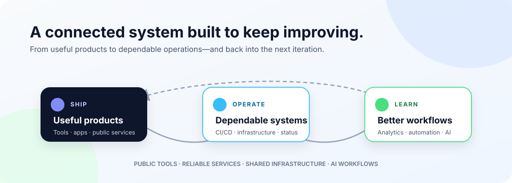
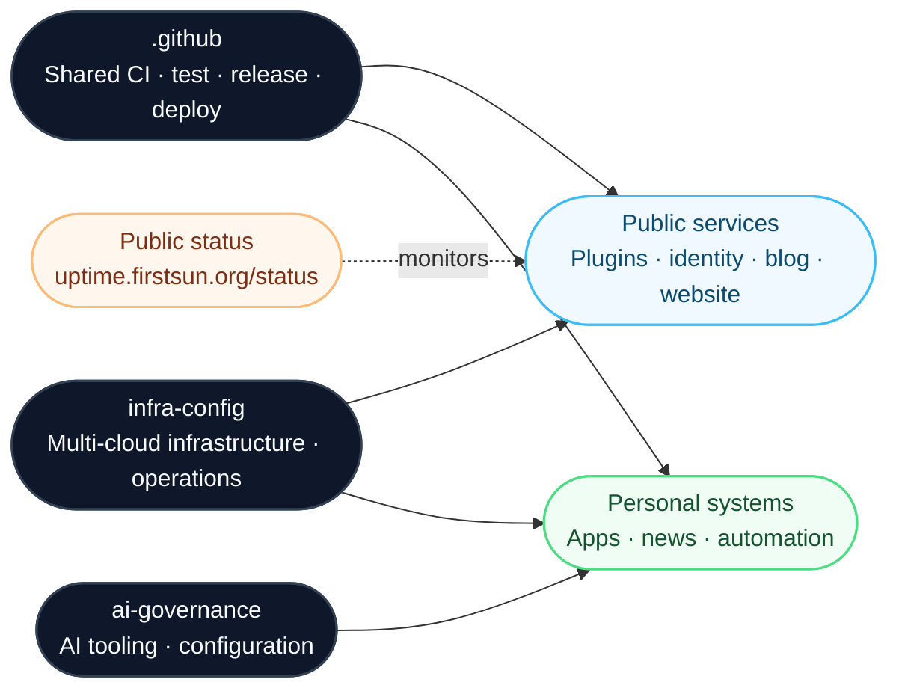

# Firstsun Dev

> We build and operate software people can rely on—from community developer tools and public services to the cloud infrastructure and AI workflows that power them.

[Live service status](https://uptime.firstsun.org/status) · [GitHub organization](https://github.com/firstsun-dev)

## Public-facing services

Projects with observable usage are listed first. Projects without public usage data follow them.

### [git-files-sync](https://github.com/firstsun-dev/git-files-sync)

**Obsidian Community Plugin for selective Git synchronization.**

A visual dashboard for controlled note-level push and pull operations with GitHub, GitLab, and Gitea.

- Published in the [Obsidian community plugin directory](https://obsidian.md/plugins?id=git-file-sync)
- Released through shared CI and release workflows

### [heaven-monorepo](https://github.com/firstsun-dev/heaven-monorepo)

**Identity and application platform on Cloudflare's edge.**

Provides OAuth and check-in services, serving approximately 80 daily visits.

- Built with Cloudflare Workers, D1, React, and pnpm workspaces
- Deployed through shared workflows
- Operational visibility through the [public status page](https://uptime.firstsun.org/status)

### [watermark-bucket-uploader](https://github.com/firstsun-dev/watermark-bucket-uploader)

**Obsidian plugin for image watermarking and storage delivery.**

Adds watermarks and uploads pasted or dropped images to S3-compatible storage, including Cloudflare R2.

### [blog](https://github.com/firstsun-dev/blog)

**Public technical blog and personal knowledge hub.**

A multilingual Astro site deployed on Cloudflare Pages, with D1-backed features.

- [Visit the blog](https://firstsun.heavenfortress.com)
- Built and deployed through shared delivery workflows

### Public website

- [heavenfortress.com](https://heavenfortress.com) — continuously operated public WordPress website

## Open-source extensions

### [code-insights](https://github.com/firstsun-dev/code-insights)

**Open-source fork with maintained product extensions.**

Adds Kilo Code support, multi-home analysis, personality insights, and work-log generation to a local-first AI coding-session analytics tool.

- [Open the app](https://code-insights.app)
- Upstream: [melagiri/code-insights](https://github.com/melagiri/code-insights) · Firstsun extensions are maintained in this fork

## Platform and operations

### [infra-config](https://github.com/firstsun-dev/infra-config)

**Multi-cloud infrastructure and operations backbone for Firstsun services.**

Terraform and Ansible manage cloud and self-hosted environments.

- Provisions and configures production and self-hosted services
- Manages backups, scheduled automation, and notifications
- Manages service access and deployment workflows
- Provides visible operational evidence through [uptime.firstsun.org/status](https://uptime.firstsun.org/status)

### Shared delivery practices

Public-facing repositories use shared workflows from [`.github`](https://github.com/firstsun-dev/.github) for automated testing, release, and deployment. This keeps delivery practices consistent across plugins, applications, and infrastructure-backed services.

## AI-assisted personal systems

### [innovation-apps](https://github.com/firstsun-dev/innovation-apps)

**Personal applications deployed on Cloudflare.**

Includes notification tools and a diet-tracking application that combines AI food analysis with FatSecret nutrition data. CI and deployments use shared repository templates and workflows.

### [news-getter](https://github.com/firstsun-dev/news-getter)

**A personal news-intelligence pipeline.**

Collects RSS sources, applies deterministic scoring and Gemini analysis, then publishes curated information through GitHub Pages.

### Knowledge and automation workflows

- [heaven-video-summary](https://github.com/firstsun-dev/heaven-video-summary) — YouTube → Whisper → Markdown → Google Drive knowledge pipeline
- [windmill-flows](https://github.com/firstsun-dev/windmill-flows) — scheduled automation for books, health, backups, and notifications
- [books-mgmt](https://github.com/firstsun-dev/books-mgmt) — Kavita collection automation and Google Drive export

## Additional work

Developer tooling, reusable foundations, and experiments.

- [ai-governance](https://github.com/firstsun-dev/ai-governance) — centralized AI tooling and configuration management
- [skills](https://github.com/firstsun-dev/skills) — reusable skills for coding agents
- [obsidian-plugin-template](https://github.com/firstsun-dev/obsidian-plugin-template) — shared plugin CI/CD template
- [my-apple-health](https://github.com/firstsun-dev/my-apple-health) — Apple Health-related personal tooling
- [kestra-flows](https://github.com/firstsun-dev/kestra-flows) — workflow orchestration experiments

## System map

